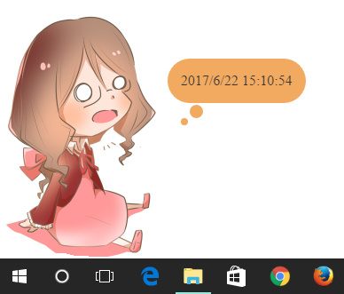
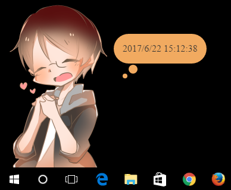

# my-desktop-widget
This is a desktop widget created with Electron.

## Requirements
- Electron

## Usage
Just run this command.

```bash
$ electron .
```

## Screenshots

### Main mascot
Illustrations by [@skrk9682](https://twitter.com/skrk9682).



### Other mascot
You can switch mascot from right-click menu.


